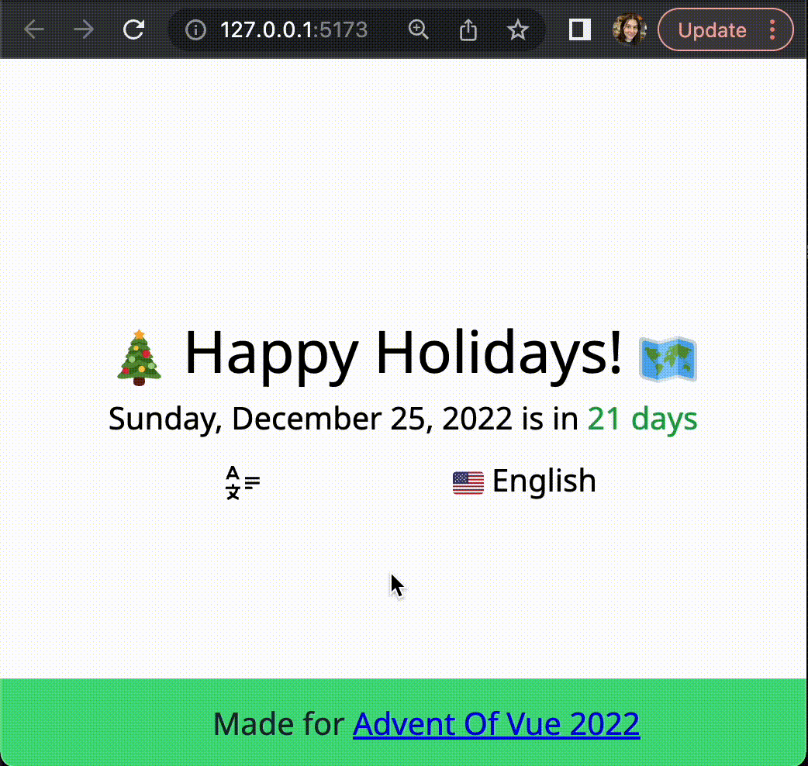
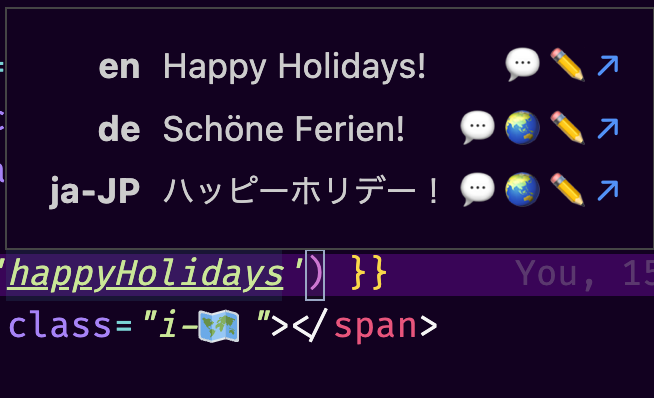
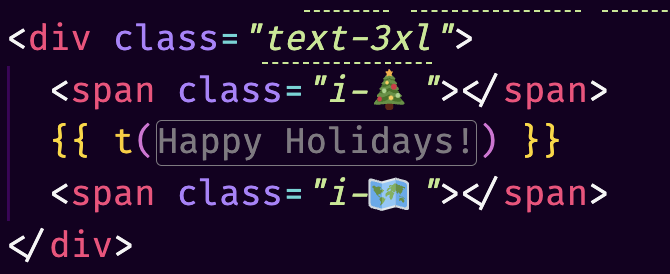
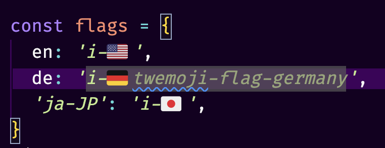

# Advent Of Vue 2022

## If you didn't get here from an email, read this section! Skip it otherwise.

[Advent Of Vue](https://adventofvue.com) is a series of 24 Vue coding challenges that are sent out every day from December 1 to December 24 via [a dedicated newsletter](https://www.getrevue.co/profile/AdventOfVue). If you'd like to receive more of these puzzles in the future, go ahead and sign up!

## Problem Description

Use [Vue I18n](https://vue-i18n.intlify.dev/) to create a localized "Happy Holidays" greeting and cycle through some locales. Then, print how many days until Christmas 😊... in 🇯🇵, 🇩🇪, and 🇺🇸!

Translations are provided, though you can add your own!

## Completed App

## Task List + Hints

- [ ] Localize "Happy Holidays" using Vue i18n.
- [ ] Setup a cycle, radio button, or other way of changing what the current locale is.
- [ ] Render the current locale.
- [ ] Render a flag emoji or icon for each locale.
- [ ] Use the Vue i18n date function to localize the date object for "Christmas".
- [ ] Render the number of days until Christmas.
- [ ] Localize the number of days until Christmas (`days`).
- [ ] Localize the entire `christmasIsComing` string with the `date` and `time` values to include joining particles ("{ date } is in { time }" or "{date}はあと{time}" -- notice there are no spaces in Japanese 🤔)
- [ ] Style the `time` part of the `christmasIsComing` string. (Hint: use `i18n-t` and the slot syntax)

### Libraries and Structure

You'll be editing `App.vue`. You don't really need anything below except for Vue i18n.

1. We're using Vue i18n for localization. [Vue i18n docs are here](https://vue-i18n.intlify.dev/)
1. Locales are provided within the `locales` directory.
1. Messages are loaded within `main.js` for you.
1. Each `*.json` file maps to a locale.
1. If you want to add your own language, you can!
1. Check out the Vite config if you'd like to see how that works.
1. [VueUse](https://vueuse.org/) is included. I ended up using it in the final solution, but it's not necessary.

#### VSCode Setup

1. Using the VSCode plugin [i18n Ally](https://github.com/lokalise/i18n-ally) is suggested -- it displays your translations inside of your editor!

    
1. This project is using [Icones](https://icones.js.org/collection/twemoji?s=cast) + UnoCSS for icons.
1. Try out the VSCode Plugin [Iconify IntelliSense](https://github.com/antfu/vscode-iconify)

    

1. This allows you to use fancy icons... but you can also just use emojis :P

### When IS Christmas?

1. No date library is provided. No one likes timezone issues, so a correct way to initialize "Christmas Day" is like so: `new Date('2022/12/25')`.
1. Fun fact: If you were to switch `/` for `-`, it would stop using your local timezone! [StackOverflow "Date is off-by-one" issue](https://stackoverflow.com/a/31732581)

  <h2>Author</h2>
  

  Jessica Sachs (Jess)

  

  

  

  <h2>Credits</h2>

  Based on [a Stackblitz project by tony19](https://stackblitz.com/edit/vue3-vite-starter)

